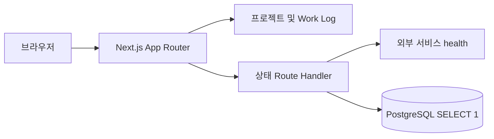

# Bugi Hub

[](https://github.com/YEONJI-P/bugi-hub/actions/workflows/ci.yml)
[](https://bugihub.site)

직접 만들고 운영하는 서비스와 작업 기록을 한곳에서 보여 주는 Next.js 애플리케이션입니다. 프로젝트 소개와 Work Log는 코드로 관리하고, 외부 서비스와 PostgreSQL의 가용성은 서버에서 확인해 공개 가능한 상태만 전달합니다.

## 주요 기능

- Sensor Monitor, Bugi Hub Web, Home Server 프로젝트 소개
- 저장소별로 탐색할 수 있는 정적 Work Log
- 외부 서비스 health와 PostgreSQL `SELECT 1` 결과를 모은 상태 패널
- non-root standalone 컨테이너와 커밋 SHA 기반 이미지 배포

## 구조



PostgreSQL은 콘텐츠 저장소가 아닙니다. 홈서버 플랫폼의 연결 상태만 확인하며 애플리케이션 데이터는 저장하지 않습니다.

## 기술 스택

- Next.js 16, React 19, TypeScript
- PostgreSQL client (`pg`), Vitest, ESLint
- Docker, GitHub Actions, GitHub Container Registry

## 로컬 실행

Node.js 22 이상과 npm을 사용합니다. 모든 환경변수는 선택 사항이므로 설정 없이도 UI와 앱 health를 확인할 수 있습니다.

```bash
npm ci
cp .env.example .env.local
npm run dev
```

기본 주소는 <http://localhost:3000>입니다. 상태 감시 대상이 설정되지 않으면 상태 패널에 `대상 없음`이 표시됩니다.

## 환경변수

| 이름 | 용도 | 기본값 |
| --- | --- | --- |
| `STATUS_SENSOR_MONITOR_BACKEND_URL` | Sensor Backend의 base URL | 미설정 |
| `STATUS_SENSOR_MONITOR_EXPLAIN_URL` | Sensor Explain의 base URL | 미설정 |
| `STATUS_REQUEST_TIMEOUT_MS` | 개별 상태 확인 제한 시간 | `3000` |
| `STATUS_REFRESH_INTERVAL_MS` | 서버 측 상태 결과 보관 시간 | `30000` |
| `POSTGRES_HOST` | 상태를 확인할 PostgreSQL 호스트 | 미설정 |
| `POSTGRES_PORT` | PostgreSQL 포트 | `5432` |
| `POSTGRES_DB` | PostgreSQL 데이터베이스 이름 | 미설정 |
| `POSTGRES_USER` | PostgreSQL 사용자 | 미설정 |
| `POSTGRES_PASSWORD` | PostgreSQL 비밀번호 | 미설정 |

실제 비밀값은 저장소나 이미지에 넣지 말고 런타임 환경에서 주입해야 합니다.

## HTTP 경로

- `GET /api/status`: 서비스와 인프라의 `UP`/`DOWN` 상태
- `GET /actuator/health`: 앱 자체 health (`{"status":"UP"}`)
- `GET /actuator/health/db`: PostgreSQL 연결 health

## 검증

```bash
npm run lint
npm run typecheck
npm test
npm run build
npm audit --audit-level=moderate
```

## 컨테이너

로컬 이미지는 다음처럼 실행합니다.

```bash
docker build -t bugi-hub:local .
docker run --rm -p 8080:8080 bugi-hub:local
```

공개 이미지는 `main`의 정확한 40자리 커밋 SHA로만 발행됩니다.

```text
ghcr.io/yeonji-p/bugi-hub:<40자리-커밋-SHA>
```

컨테이너는 non-root 사용자로 실행되며 `/actuator/health`를 Docker healthcheck로 사용합니다.

## CI와 배포 경계

GitHub Actions는 lint, typecheck, test, production build, 컨테이너 health 검증을 모두 통과한 커밋만 GHCR에 발행합니다. 실행 이미지 pin, 네트워크, 공개 라우팅, TLS와 런타임 비밀값은 인프라 저장소가 소유합니다. 인프라 이미지 pin PR 자동화는 updater 계약을 별도로 확정한 뒤 연결합니다.

## 관련 프로젝트

- [Sensor Monitor](https://github.com/YEONJI-P/sensor-monitor)
- [Home Server Infra](https://github.com/YEONJI-P/home-server-infra) — 공개 예정

## 보안

취약점 제보 방법은 [SECURITY.md](SECURITY.md)를 확인해 주세요. 공개 Issue에는 비밀값이나 악용 가능한 세부 정보를 올리지 마세요.

## 라이선스

이 저장소에는 오픈 소스 라이선스가 부여되지 않았습니다. 별도 허가 없이 코드의 복제, 수정, 재배포 권한을 제공하지 않습니다.
